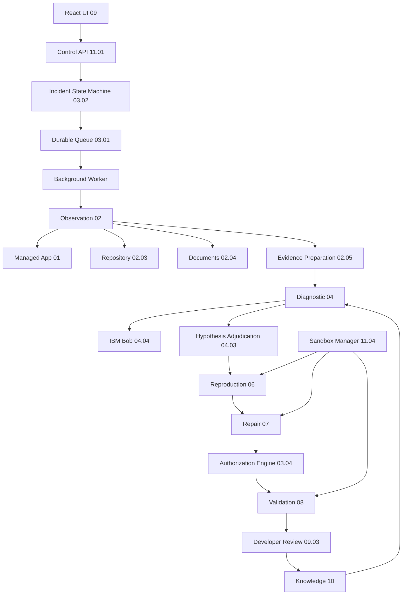

# Software Immune System — Implementation Plan

## Top-Level Overview

Build a complete, production-grade monorepo implementing the Software Immune System as specified. The system accepts a TypeScript/Node.js repository and a failure report, collects source-linked evidence, investigates competing explanations via IBM Bob, reproduces the failure in an isolated sandbox, prepares a constrained repair, runs protected acceptance checks, and delivers a review-ready change package to a human developer.

**Stack decisions:**
- Monorepo: pnpm workspaces
- Control API: Fastify (TypeScript)
- Background worker: Node.js process (TypeScript)
- React UI: Vite + React 18 + Tailwind CSS + shadcn/ui
- Database: PostgreSQL via `pg` (no ORM), migrations via `node-pg-migrate`
- Validation: `zod` at all API/module boundaries
- Tests: Vitest across all packages
- Sandbox: Docker/Podman, runtime-selectable via `SANDBOX_RUNTIME` env var
- Bob integration: behind `BOB_INTEGRATION_ENABLED` feature flag, stubs when off
- Logging: structured JSON (`pino`)

**Primary demonstration scenario:** duplicate-payment caused by timeout + unsafe retries (12.03.01), exercisable through the full `01 → 02 → 03 → 04 → 06 → 07 → 08 → 09` path.

**Node annotation convention:** every class, function, route, migration, and component carries a `@node XX.XX.XX` JSDoc tag or `// node: XX.XX.XX` inline comment.

---

## Sub-Task 1 — Monorepo Scaffold and Root Configuration

**Status:** `[ ] pending`

**Intent:** Establish the workspace skeleton that every subsequent package builds on. Get TypeScript, pnpm workspaces, Docker Compose, and shared tooling in place so all packages can be added without restructuring.

**Expected Outcomes:**
- `pnpm-workspace.yaml` lists all 13 packages
- `tsconfig.base.json` sets `strict: true`, `moduleResolution: bundler`, `target: ES2022`
- `package.json` root defines workspace scripts: `build`, `test`, `typecheck`, `lint`, `migrate`
- `docker-compose.yml` declares services: `postgres`, `managed-app`, `control-api`, `worker`, `ui`
- `.env.example` contains every required key with safe placeholder defaults and no secrets
- `vitest.workspace.ts` at root enumerates all package test configs

**Todo List:**
1. Create `package.json` (root) with pnpm workspace scripts and devDependency versions pinned
2. Create `pnpm-workspace.yaml`
3. Create `tsconfig.base.json`
4. Create `docker-compose.yml` with all five services, health checks, and named volumes
5. Create `.env.example` — keys: `DATABASE_URL`, `BOB_INTEGRATION_ENABLED`, `BOB_API_ENDPOINT`, `BOB_API_KEY`, `SANDBOX_RUNTIME`, `ARTIFACT_STORAGE_PATH`, `CONTROL_API_PORT`, `WORKER_CONCURRENCY`, `JWT_SECRET`, `NODE_ENV`
6. Create `vitest.workspace.ts`
7. Create `.gitignore`
8. Create `eslint.config.js` with TypeScript rules

**Relevant Context:** Workspace root only. All 13 packages listed in `packages/` directory as defined in the spec layout.

---

## Sub-Task 2 — Managed Application (Package `managed-app`, Node 01)

**Status:** `[ ] pending`

**Intent:** Implement the self-contained checkout + payment simulator + fault injection sub-application that serves as the primary defect vehicle. This is the application that the immune system investigates. The duplicate-payment defect (unsafe retry without idempotency) must be the initial buggy state so the system has something to find and fix.

**Expected Outcomes:**
- `packages/managed-app/src/checkout/` — request handler (01.01.01), order-state manager (01.01.02), payment client (01.01.03)
- `packages/managed-app/src/payment-simulator/` — request processor (01.02.01), idempotency processor (01.02.02), persistence processor (01.02.03), status lookup (01.02.04)
- `packages/managed-app/src/fault-injection/` — all six fault types (01.03.01–01.03.06)
- `packages/managed-app/src/correctness-spec/` — contracts and invariants (01.04.01–01.04.07)
- Fastify server exposing `POST /checkout`, `POST /payments`, `GET /payments/:id`, `POST /fault-injection/activate`, `POST /fault-injection/deactivate`
- PostgreSQL tables: `orders`, `payment_attempts`, `payments`, `fault_configs`
- Test suite: all invariants from 01.04.04, 01.04.05, 01.04.06; full idempotency processor including concurrent duplicates (01.02.02)
- Protected acceptance tests in `tests/acceptance/` — must not be weakenable

**Todo List:**
1. Create `packages/managed-app/package.json` with Fastify, pg, zod, pino, vitest
2. Create `packages/managed-app/tsconfig.json` extending base
3. Create `packages/managed-app/vitest.config.ts`
4. Create migrations: `001_create_orders.sql`, `002_create_payment_attempts.sql`, `003_create_payments.sql`, `004_create_fault_configs.sql`
5. Implement `src/checkout/handler.ts` — validates order input with zod, calls order-state manager and payment client (01.01.01)
6. Implement `src/checkout/order-state-manager.ts` — creates pending order, records payment attempt, marks confirmed/uncertain (01.01.02)
7. Implement `src/checkout/payment-client.ts` — constructs payment request, attaches logical payment identity (orderId), applies 5s timeout, applies retry with UNSAFE non-idempotent behavior in defect state (01.01.03)
8. Implement `src/payment-simulator/processor.ts` — validates amount/currency/caller/idempotency key (01.02.01)
9. Implement `src/payment-simulator/idempotency.ts` — scopes key to caller+operation, computes SHA-256 fingerprint, uses `SELECT ... FOR UPDATE SKIP LOCKED` for atomic reservation, handles concurrent in-progress (01.02.02)
10. Implement `src/payment-simulator/persistence.ts` — transactional create + commit (01.02.03)
11. Implement `src/payment-simulator/status-lookup.ts` — retrieve by logical id, enforce caller isolation (01.02.04)
12. Implement `src/fault-injection/engine.ts` — delayed response, dropped response, concurrent duplicates, temporary unavailability, activation/expiry controls, test-only guard (01.03.01–01.03.06)
13. Implement `src/correctness-spec/invariants.ts` — export typed invariant definitions and assertion helpers (01.04.01–01.04.07)
14. Implement `src/app.ts` — Fastify server wiring all routes
15. Write `tests/unit/idempotency.test.ts` — concurrent duplicate requests, conflicting payload rejection, existing result return
16. Write `tests/unit/invariants.test.ts` — 01.04.04 (no duplicate charge), 01.04.05 (amount+currency), 01.04.06 (timeout uncertainty)
17. Write `tests/acceptance/checkout-correctness.test.ts` — protected acceptance tests (01.04.07)
18. Write `tests/unit/fault-injection.test.ts` — activation, expiry, test-only restriction

**Relevant Context:**
- The defect is intentional: `payment-client.ts` initially does NOT pass a stable idempotency key on retries, causing duplicate charges when a timeout fires after server commit
- The payment simulator (01.02.02) enforces idempotency correctly — the bug is in the client
- Fault injection is test-only (`NODE_ENV !== 'production'` guard)
- Protected acceptance tests must never be deleted or weakened — the validation subsystem (08.04) detects this

---

## Sub-Task 3 — Platform Foundation (Package `platform`, Node 11)

**Status:** `[ ] pending`

**Intent:** Build the shared infrastructure layer — database access, migrations, artifact storage, sandbox manager, observability, and reliability safeguards. Every other package depends on this. Must be implemented before transport, diagnostic, or repair packages.

**Expected Outcomes:**
- `packages/platform/migrations/` — all 16 tables with correct FK constraints and indexes
- `packages/platform/src/persistence/` — typed query functions for every table, connection pool management, outage handler (11.02)
- `packages/platform/src/control-api/` — Fastify plugin: input validation, JWT authentication, per-incident authorization, rate limits, structured errors (11.01)
- `packages/platform/src/artifact-storage/` — write/read/checksum/cleanup for sanitized logs, test reports, patches (11.03)
- `packages/platform/src/sandbox/` — Docker/Podman process spawner with resource limits, no production secrets, restricted mounts (11.04)
- `packages/platform/src/observability/` — pino logger, queue depth gauge, worker health probe, stalled incident detector (11.05)
- `packages/platform/src/reliability/` — idempotent command wrapper, workflow checkpoint manager, explicit stop on artifact failure (11.06)
- Test suite: worker explicit-stop on DB outage (11.06), sandbox resource limit enforcement

**Todo List:**
1. Create `packages/platform/package.json` with pg, node-pg-migrate, zod, pino, vitest, uuid
2. Create `packages/platform/tsconfig.json`
3. Create all 16 migration files in `packages/platform/migrations/` (see schema requirements in spec): `incidents`, `events`, `tasks`, `authorization_decisions`, `evidence_bundles`, `evidence_records`, `sensor_health`, `hypotheses`, `experiments`, `regression_tests`, `repair_candidates`, `validation_runs`, `approval_records`, `knowledge_records`, `measurement_events`, plus managed-app tables if not in managed-app
4. Implement `src/persistence/db.ts` — pg Pool with connect/disconnect, outage detection (11.02)
5. Implement `src/persistence/queries/` — one file per table group with typed query functions
6. Implement `src/control-api/plugin.ts` — Fastify plugin: JWT auth middleware, per-incident auth check, rate limiting, zod request validation, structured error serializer (11.01)
7. Implement `src/artifact-storage/storage.ts` — write artifact with SHA-256 checksum, read with integrity check, cleanup by incident, storage quota enforcement (11.03)
8. Implement `src/sandbox/manager.ts` — spawns Docker or Podman container based on `SANDBOX_RUNTIME` env var; enforces: unprivileged user, `--read-only` rootfs with explicit tmpfs mounts, no `--network host`, no production secrets, `--cpus`, `--memory`, `--pids-limit`, `--timeout`; teardown on completion (11.04). **Comment must explain why limits are enforced in process-spawner code, not in prompts.**
9. Implement `src/observability/metrics.ts` — structured pino child loggers, gauge helpers for queue depth/worker health/sensor failures/auth denials/stalled incidents (11.05)
10. Implement `src/reliability/safeguards.ts` — idempotent command wrapper (dedup by command ID), workflow checkpoint writer/reader, artifact-write failure handler (explicit stop), DB outage waiter (11.06)
11. Write `tests/unit/sandbox.test.ts` — verify resource limit flags are set, no production secrets in env
12. Write `tests/unit/reliability.test.ts` — worker stops on DB outage, artifact write failure stops workflow

**Relevant Context:**
- **Authorization comment required** in `control-api/plugin.ts` and `sandbox/manager.ts`: explain why controls are code, not prompts (Rule 4, 5 of mandatory rules)
- Migrations use `node-pg-migrate` — `package.json` script: `"migrate": "node-pg-migrate up"` with `DATABASE_URL`
- All tables need `created_at TIMESTAMPTZ DEFAULT now()` and `updated_at TIMESTAMPTZ DEFAULT now()`
- Sandbox manager is the enforcement boundary for 11.04 — it cannot be bypassed by any agent output

---

## Sub-Task 4 — Transport and Control Subsystem (Package `transport`, Node 03)

**Status:** `[ ] pending`

**Intent:** Implement the durable event queue, incident state machine, task coordinator, and authorization engine. This is the circulatory system that moves evidence and control signals between all other subsystems.

**Expected Outcomes:**
- `packages/transport/src/delivery/` — PostgreSQL-backed durable queue with claim+lease+ack+retry+quarantine+backpressure (03.01)
- `packages/transport/src/incident-state-machine/` — full state machine: `created → observing → diagnosing → reproducing → repairing → validating → review_ready | rejected | escalated | abstained`; deduplication; restart recovery (03.02)
- `packages/transport/src/task-coordination/` — dependency DAG scheduler, parallel dispatch, input snapshot, output schema validation with zod, partial results, time+attempt budgets (03.03)
- `packages/transport/src/authorization/` — read/workspace-write/approved-command/network/approval permissions; expiry; **denial audit records persisted before denial returned** (03.04)
- Test suite: all state-machine transitions including invalid ones (03.02.02), authorization denial + audit record creation (03.04.07), backpressure admission limit

**Todo List:**
1. Create `packages/transport/package.json` with pg, zod, pino; peer-depends on `@sis/platform`
2. Create `packages/transport/tsconfig.json`
3. Implement `src/delivery/queue.ts` — `enqueue`, `claim` (with lease timeout), `ack`, `nack`, `quarantine`; bounded retry using exponential backoff with jitter; `admissionCheck` to enforce backpressure limit (03.01.01–03.01.07)
4. Implement `src/incident-state-machine/machine.ts` — `StateMachine` class with allowed-transition table, `transition(incidentId, newState, actorId)` method that validates against table and writes to DB; `createIncident` with deduplication by fingerprint; `recoverStalled` for restart (03.02.01–03.02.07)
5. Define state enum: `CREATED | OBSERVING | DIAGNOSING | REPRODUCING | REPAIRING | VALIDATING | REVIEW_READY | REJECTED | ESCALATED | ABSTAINED`
6. Implement `src/task-coordination/scheduler.ts` — build dependency DAG from task `dependsOn` array; dispatch independent tasks in parallel; snapshot task inputs at dispatch time; validate outputs with zod schema from task definition; track attempt count and wall-clock budget (03.03.01–03.03.06)
7. Implement `src/authorization/engine.ts` — `AuthorizationEngine` class; methods: `checkRead`, `checkWrite`, `checkCommand`, `checkNetwork`, `checkApproval`; each method: (a) evaluates permission, (b) if denied, writes `authorization_decisions` record with `decision: 'denied'` BEFORE returning, (c) returns typed result. **Comment must explain: authorization enforced here in service code so no model-generated text can bypass it (Rule 4).** (03.04.01–03.04.07)
8. Implement `src/authorization/registry.ts` — approved command registry: allowed commands loaded from config, not from any model output (03.04.03)
9. Write `tests/unit/state-machine.test.ts` — all valid transitions, all invalid transitions (expect rejection), deduplication, restart recovery
10. Write `tests/unit/authorization.test.ts` — denied operation creates audit record before returning denial, approval expiry, scope enforcement
11. Write `tests/unit/delivery.test.ts` — claim+ack, nack+retry, quarantine after max retries, backpressure admission

**Relevant Context:**
- Authorization engine is the chokepoint for Rule 4: "authorization checks must execute as middleware or service code before any agent-generated instruction is acted upon"
- The `authorization_decisions` table must be written atomically with the denial response — if the DB write fails, the operation is denied regardless (fail-safe)
- State machine allowed-transition table must be a hardcoded constant, not configurable by any runtime input

---

## Sub-Task 5 — Observation Subsystem (Package `observation`, Node 02)

**Status:** `[ ] pending`

**Intent:** Implement all four observation engines (runtime, repository, document, sensor lifecycle) and the evidence preparation pipeline. This package turns raw signals into validated, redacted, timestamped evidence bundles that the diagnostic subsystem can consume.

**Expected Outcomes:**
- `packages/observation/src/sensor-lifecycle/` — sensor registry, scheduling (event/periodic/incident), health tracking (02.01)
- `packages/observation/src/runtime/` — log collector (02.02.01), trace collector (02.02.02), metric collector (02.02.03), business-state observer with read-only DB queries (02.02.04)
- `packages/observation/src/repository/` — Git adapter (02.03.01), source indexer (02.03.02), change collector (02.03.03), test observer (02.03.04)
- `packages/observation/src/document/` — markdown/text ingestion, section extraction, API expectation extraction, runbook extraction, untrusted-content classification (02.04)
- `packages/observation/src/evidence-preparation/` — schema validator, secret redactor, deduplicator, timestamp normalizer (original + collection + uncertainty), identity correlator, bundle writer with source manifest + gaps + checksums (02.05)
- Test suite: evidence bundle schema validation, secret redaction (02.05.01, 02.05.02), missing telemetry recorded as gap not health

**Todo List:**
1. Create `packages/observation/package.json` with simple-git, pg, zod, pino, vitest
2. Create `packages/observation/tsconfig.json`
3. Implement `src/sensor-lifecycle/registry.ts` — `SensorRegistry`: register sensor with source type, schema, required permissions; query by type (02.01.01)
4. Implement `src/sensor-lifecycle/scheduler.ts` — event-triggered, periodic (setInterval with jitter), incident-specific collection; calls `SensorRegistry` to dispatch (02.01.02)
5. Implement `src/sensor-lifecycle/health.ts` — track last successful collection, latency, failed count per sensor; write to `sensor_health` table; emit missing-source notification (02.01.03)
6. Implement `src/runtime/log-collector.ts` — parse structured JSON log lines, preserve source file + line references, capture error and retry events (02.02.01)
7. Implement `src/runtime/trace-collector.ts` — parse OpenTelemetry-compatible trace JSON; capture traceId, spanId, parentSpanId; identify service-call boundaries (02.02.02)
8. Implement `src/runtime/metric-collector.ts` — collect request counts, error counts, duration histograms, queue depths from managed-app metrics endpoint (02.02.03)
9. Implement `src/runtime/business-state-observer.ts` — read-only scoped DB queries for payment cardinality checks and order/payment consistency; records observation timestamp; never mutates (02.02.04)
10. Implement `src/repository/adapter.ts` — resolve repo path, record current commit via `simple-git`, detect uncommitted changes, preserve original working directory (02.03.01)
11. Implement `src/repository/source-indexer.ts` — locate TypeScript modules, index exports/imports using regex/AST scan, map stack frames to source lines, record unresolved dynamic relationships (02.03.02)
12. Implement `src/repository/change-collector.ts` — recent commits (`git log`), file diffs, config diffs, lockfile diffs (02.03.03)
13. Implement `src/repository/test-observer.ts` — discover Vitest test files, collect existing failures, parse coverage JSON, record unrelated baseline failures (02.03.04)
14. Implement `src/document/ingester.ts` — markdown + plain text ingestion, section/heading extraction, API expectation extraction (TypeScript interface blocks), runbook action extraction, document version recording, untrusted-content flag (02.04.01–02.04.06)
15. Implement `src/evidence-preparation/validator.ts` — zod schema validator for each evidence record type (02.05.01)
16. Implement `src/evidence-preparation/redactor.ts` — regex + pattern-based secret redaction (API keys, JWTs, passwords, credit-card-like patterns), PII redaction (emails, UUIDs in certain contexts) (02.05.02). **No real secrets in tests.**
17. Implement `src/evidence-preparation/deduplicator.ts` — content hash deduplication within a bundle (02.05.03)
18. Implement `src/evidence-preparation/timestamp-normalizer.ts` — preserve original timestamp, add collection timestamp, set `clockOrderUncertain: boolean` flag (02.05.04)
19. Implement `src/evidence-preparation/identity-correlator.ts` — link incident ID, trace ID, request-attempt ID, logical business-operation ID (02.05.05)
20. Implement `src/evidence-preparation/bundle-writer.ts` — assembles `EvidenceBundle`: source manifest, evidence references, collection gaps, artifact checksums; writes to `evidence_bundles` + `evidence_records` tables; writes artifact via `platform/artifact-storage` (02.05.06)
21. Write `tests/unit/redactor.test.ts` — verify secrets stripped, PII stripped, non-sensitive data preserved
22. Write `tests/unit/bundle-writer.test.ts` — schema validation, gap recording when collector fails, checksum correctness
23. Write `tests/unit/sensor-health.test.ts` — missing-source notification on failed collection, gap recorded not fabricated health

**Relevant Context:**
- Rule 7: a failure in one collector must not suppress another — each collector runs in an isolated try/catch and writes a `CollectionGap` record on error
- Rule 8: missing telemetry = collection gap record, not assumed healthy
- Rule 9: redaction runs before any write to bundle or DB
- Rule 10: `TimestampedEvidence` type must carry `originalTimestamp`, `collectionTimestamp`, `clockOrderUncertain`

---

## Sub-Task 6 — Diagnostic Subsystem (Package `diagnostic`, Node 04)

**Status:** `[ ] pending`

**Intent:** Implement the system-model builder, detection/localization engine, hypothesis adjudication engine, and IBM Bob investigation task wrappers. This is the analytical core that turns evidence into explicit, evidence-backed hypotheses.

**Expected Outcomes:**
- `packages/diagnostic/src/system-model/` — service topology, source-to-service map, contract-to-endpoint map, test-to-behavior map, model uncertainty (04.01)
- `packages/diagnostic/src/detection/` — invariant/contract/threshold violation detectors, request sequence reconstructor, affected-component locator, recent-change correlator (04.02)
- `packages/diagnostic/src/hypothesis/` — evidence-reference validator, contradiction checker, missing-evidence checker, alternative-explanation register, duplicate-claim merger, experiment requirement generator, status assigner with exactly four permitted values (04.03)
- `packages/diagnostic/src/bob-tasks/` — repository investigator, runtime investigator, contract/test investigator, coordinator; all behind `BOB_INTEGRATION_ENABLED` flag with explicit stub notices (04.04)
- Test suite: hypothesis status assignment with and without evidence references (04.03.07), no status values outside the four permitted

**Todo List:**
1. Create `packages/diagnostic/package.json` with zod, pino, vitest; peer-depends on `@sis/platform`, `@sis/observation`
2. Create `packages/diagnostic/tsconfig.json`
3. Implement `src/system-model/builder.ts` — `SystemModelBuilder`: builds topology graph from source-indexer output; maps source files to services; maps contracts (TypeScript interfaces) to endpoints; maps test files to behaviors; records model version and uncertainty (04.01.01–04.01.05)
4. Implement `src/detection/detector.ts` — `DetectionEngine`: runs invariant violation checks (e.g. cardinality > 1 for same logical payment), contract violation checks (unexpected response shapes), configurable threshold checks, sequence reconstruction from trace data, affected component localization, recent-change correlation (04.02.01–04.02.06)
5. Implement `src/hypothesis/adjudicator.ts` — `HypothesisAdjudicator`:
   - `validateEvidenceRefs(hypothesis)` — checks each ref is in the evidence bundle and validated (04.03.01)
   - `checkContradictions(hypothesis, evidenceBundle)` — finds contradicting evidence records (04.03.02)
   - `checkMissingEvidence(hypothesis)` — identifies evidence types not yet collected (04.03.03)
   - `registerAlternative(hypothesis, alternative)` — adds to alternative-explanation register (04.03.04)
   - `mergeDuplicateClaims(claims)` — merges by content hash; does NOT increase evidential strength (04.03.05) — Rule 12 comment required
   - `generateExperimentRequirements(hypothesis)` — produces experiment spec for 06.01 (04.03.06)
   - `assignStatus(hypothesis)` → `'Supported' | 'Contradicted' | 'Reproduced within stated conditions' | 'Insufficient evidence'` — exactly these four, enforced by TypeScript union type and zod enum (04.03.07)
6. Implement `src/bob-tasks/bob-client.ts` — HTTP client for IBM Bob API; reads `BOB_INTEGRATION_ENABLED`, `BOB_API_ENDPOINT`, `BOB_API_KEY`; when flag off, returns `{ stub: true, notice: 'Bob integration disabled — running in stub mode' }`
7. Implement `src/bob-tasks/repository-investigator.ts` — sends evidence bundle to Bob with prompt to inspect retry implementation, timeout handling, identify change locations; parses structured JSON response (04.04.01)
8. Implement `src/bob-tasks/runtime-investigator.ts` — sends trace + log evidence to Bob to reconstruct request sequence, identify persisted outcomes, separate symptoms from effects (04.04.02)
9. Implement `src/bob-tasks/contract-test-investigator.ts` — sends source index + test discovery to Bob to compare implementation with expectations, identify missing scenarios, propose discriminating tests (04.04.03)
10. Implement `src/bob-tasks/coordinator.ts` — orchestrates the three Bob tasks with bounded inputs; collects structured findings; calls `HypothesisAdjudicator` to adjudicate; requests evidence-backed next actions (04.04.04)
11. Write `tests/unit/adjudicator.test.ts` — hypothesis with valid evidence refs → `Supported`; hypothesis with no evidence refs → `Insufficient evidence`; hypothesis contradicted by evidence → `Contradicted`; attempt to create invalid status value → compile error + runtime zod rejection
12. Write `tests/unit/duplicate-claim.test.ts` — two identical Bob outputs do not increase evidential strength; merged as duplicate (Rule 12)

**Relevant Context:**
- Rule 11: `Supported` requires at least one validated evidence reference — enforced in `assignStatus` before setting status
- Rule 12: `mergeDuplicateClaims` comment must state why agreement between agents without independent evidence is not confirmation
- Rule 13: `HypothesisStatus` type = `z.enum(['Supported', 'Contradicted', 'Reproduced within stated conditions', 'Insufficient evidence'])` — no other values
- Bob tasks receive authorization-checked, evidence-backed inputs only — they cannot read files or issue commands directly

---

## Sub-Task 7 — Containment Subsystem (Package `containment`, Node 05)

**Status:** `[ ] pending`

**Intent:** Implement the optional containment path — impact assessment, mitigation selection, and mitigation verification. Executes earlier than the full repair path when its preconditions and authorization requirements are satisfied.

**Expected Outcomes:**
- `packages/containment/src/impact/` — impact assessment: affected endpoint, operation type, known affected records, unknown impact explicitly recorded (05.01)
- `packages/containment/src/mitigation-selection/` — predefined reversible actions with preconditions, approval requirements, expected benefit, availability trade-off, expiry+reversal conditions (05.02)
- `packages/containment/src/mitigation-verification/` — pre-action state capture, apply authorized action, post-action state observation, adverse effect detection, reverse or escalate (05.03)

**Todo List:**
1. Create `packages/containment/package.json`
2. Create `packages/containment/tsconfig.json`
3. Implement `src/impact/assessor.ts` — `ImpactAssessor`: queries DB for affected records by incident scope; categorizes by endpoint and operation type; explicitly records unknown impact as `unknownImpact: true` with explanation (05.01)
4. Implement `src/mitigation-selection/selector.ts` — `MitigationSelector`: catalog of predefined reversible actions (e.g. disable fault injection, toggle feature flag, circuit breaker); each action has preconditions checked against current state, requires authorization, records expected benefit and availability trade-off, sets expiry duration and reversal command (05.02)
5. Implement `src/mitigation-verification/verifier.ts` — `MitigationVerifier`: snapshots pre-action state, applies action via authorized command (through 03.04), observes post-action state, compares for adverse effects using detection engine (05.03); calls reversal if adverse effect detected; escalates incident if reversal fails
6. Write `tests/unit/containment.test.ts` — impact assessor records unknown impact; mitigation reversal triggered on adverse effect; unauthorized mitigation rejected before execution

---

## Sub-Task 8 — Reproduction Subsystem (Package `reproduction`, Node 06)

**Status:** `[ ] pending`

**Intent:** Implement the experiment specification, environment preparation (isolated Git worktree + DB schema), scenario execution, causal discrimination, and regression artifact generation. This is where the failure is reproduced in isolation and proven to be caused by the specific suspected mechanism.

**Expected Outcomes:**
- `packages/reproduction/src/specification/` — typed `ExperimentSpec` with hypothesis ref, env vars, controlled fault, input sequence, expected observation, time+resource limits (06.01)
- `packages/reproduction/src/environment/` — isolated Git worktree, pinned deps, dedicated DB schema, deterministic fixtures, readiness checks, environment manifest (06.02)
- `packages/reproduction/src/scenario/` — fault activation, payment submission, commit-before-timeout capture, retry observation, result query, trial repetition (06.03)
- `packages/reproduction/src/causal-discrimination/` — faulty vs normal comparison, retry identity behavior variation, alternative explanation checking, causal conclusion limits (06.04)
- `packages/reproduction/src/regression-artifact/` — executable test generation, failure verification on defective baseline, SHA-256 hash persistence, execution evidence attachment, reproduction command export (06.05)
- Test suite: causal discrimination between faulty and normal conditions (Rule 14)

**Todo List:**
1. Create `packages/reproduction/package.json` with simple-git, pg, zod, pino, vitest
2. Implement `src/specification/spec.ts` — `ExperimentSpec` zod schema and TypeScript type (06.01)
3. Implement `src/environment/preparer.ts` — `EnvironmentPreparer`: (a) `git worktree add` via simple-git to isolated path; (b) runs `pnpm install --frozen-lockfile` in worktree via sandbox (11.04); (c) creates dedicated PostgreSQL schema `exp_<uuid>`; (d) loads deterministic SQL fixtures; (e) polls service health endpoint until ready; (f) writes `EnvironmentManifest` with git commit, dep lockfile hash, schema name, fixture checksums (06.02)
4. Implement `src/scenario/executor.ts` — `ScenarioExecutor`: activates fault via fault-injection API, submits payment via checkout API, waits for commit-before-timeout event (polls logs), observes retry events, queries persisted payment count, repeats for `spec.trialCount` trials (06.03)
5. Implement `src/causal-discrimination/discriminator.ts` — `CausalDiscriminator`: runs scenario under two conditions (faulty vs clean identity), varies retry identity behavior (fixed vs regenerated idempotency key), checks each alternative explanation, records causal conclusion with explicit limits on what was NOT proven (06.04) — Rule 14 comment required
6. Implement `src/regression-artifact/generator.ts` — `RegressionArtifactGenerator`: (a) generates a Vitest test file that reproduces the failure; (b) runs the test against the defective baseline in sandbox — asserts it FAILS; (c) computes SHA-256 of test file content; (d) persists to `regression_tests` table with hash and execution evidence; (e) exports reproduction command string (06.05) — Rule 15: must verify failure on defective baseline before storing
7. Write `tests/unit/causal-discrimination.test.ts` — discriminator confirms causal link when retry key varies; discriminator records "no causal conclusion" when results same under both conditions
8. Write `tests/unit/regression-artifact.test.ts` — generated test fails on defective baseline; hash persisted; fails if baseline check not performed first

**Relevant Context:**
- Rule 14: symptom reproduction alone is insufficient — `CausalDiscriminator` must vary the suspected mechanism
- Rule 15: `RegressionArtifactGenerator.generate()` throws if the baseline failure check was not performed and passed
- Environment preparation uses `EnvironmentPreparer` which calls `platform/sandbox` for all command execution — sandbox limits apply

---

## Sub-Task 9 — Repair Subsystem (Package `repair`, Node 07)

**Status:** `[ ] pending`

**Intent:** Implement repair candidate planning, payment-specific repair specification (idempotency fix), change authorization, Bob-assisted patch execution, and recovery planning. The repair must fix the confirmed mechanism (idempotency key stabilization), not just suppress symptoms.

**Expected Outcomes:**
- `packages/repair/src/candidate-planning/` — root-cause-to-change mapping, alternative fix comparison, minimal change selection, contract compatibility, protected invariant references (07.01)
- `packages/repair/src/payment-spec/` — stable logical key, atomic reservation, concurrency-safe reuse, conflicting payload rejection, unknown-outcome reconciliation, duplicate record handling report (07.02)
- `packages/repair/src/change-authorization/` — allowed file list, max change scope, migration review requirement, test modification restrictions, human approval gate (07.03)
- `packages/repair/src/patch-execution/` — Bob-assisted code modification, candidate commit, diff generation, format+typecheck, audit attachment (07.04)
- `packages/repair/src/recovery-planning/` — revert procedure, migration recovery assessment, persisted-data reconciliation, irreversible-effect warning, **no auto-refund** (07.05)
- Test suite: unsafe repair (timeout increase) rejected; protected test file modification rejected without approval record

**Todo List:**
1. Create `packages/repair/package.json` with zod, pino, simple-git, vitest
2. Implement `src/candidate-planning/planner.ts` — `CandidatePlanner`: maps root cause from hypothesis to candidate changes; compares alternatives (fix idempotency key vs increase timeout vs suppress error); selects minimal sufficient change; verifies contract compatibility via system model; references protected invariants from 01.04 (07.01). Rule 16 comment: increasing timeouts without fixing idempotency is rejected.
3. Implement `src/payment-spec/spec.ts` — `PaymentRepairSpec`: typed specification for the idempotency fix: stable logical key = `${callerId}:${orderId}`; atomic key reservation using `INSERT ... ON CONFLICT`; concurrency-safe result reuse; conflicting payload rejection; unknown-outcome reconciliation; duplicate record handling report (07.02)
4. Implement `src/change-authorization/authorizer.ts` — `ChangeAuthorizer`: checks proposed file changes against allowed file list; enforces max-changed-lines limit; flags migration files for human review; rejects modification of protected test files and validation code without `approval_records` entry (07.03). **Comment: enforced in code, not prompt.**
5. Implement `src/patch-execution/executor.ts` — `PatchExecutor`: requests Bob to generate code changes (when `BOB_INTEGRATION_ENABLED`); validates generated diff against change authorizer; applies diff to worktree via `git apply`; creates candidate commit; generates unified diff; runs `tsc --noEmit` + `eslint` via sandbox; attaches execution audit record (07.04)
6. Implement `src/recovery-planning/planner.ts` — `RecoveryPlanner`: documents code revert procedure (`git revert`); assesses migration reversibility; identifies persisted-data reconciliation requirements (duplicate payments need manual deduplication); **explicitly records** that reverting code does not reverse completed payments; records irreversible-effect warning; **no auto-refund or destructive cleanup** (07.05) — Rule 17 comment required
7. Write `tests/unit/change-authorization.test.ts` — protected test file modification rejected; migration requires human approval; allowed file modification passes; unsafe repair (timeout only) rejected
8. Write `tests/unit/recovery-planning.test.ts` — irreversible-effect warning always present; no auto-refund in recovery steps

---

## Sub-Task 10 — Validation Subsystem (Package `validation`, Node 08)

**Status:** `[ ] pending`

**Intent:** Implement the protected validation runner — six mandatory gate groups (identity binding, execution gates, business correctness gates, safety/scope gates, performance checks) and the result adjudication engine. The validator runs outside the repair agent's writable file scope and reads actual command exit codes.

**Expected Outcomes:**
- `packages/validation/src/identity/` — binds candidate commit + environment manifest + acceptance-suite hash; invalidates results on any change (08.01)
- `packages/validation/src/execution-gates/` — build+typecheck, existing test suite, original failure scenario, new regression test, baseline comparison (08.02)
- `packages/validation/src/business-gates/` — single logical charge, concurrent duplicate safety, same-key conflicting amount/currency rejection, caller-scoped key isolation, order/payment consistency (08.03)
- `packages/validation/src/safety-gates/` — no protected-test weakening, no validator modification, no unauthorized file changes, no secrets in artifacts, no unapproved external access (08.04)
- `packages/validation/src/performance-checks/` — concurrent-request scenario, DB lock-wait observation, duration comparison, resource budget check, no inference beyond tested load (08.05)
- `packages/validation/src/adjudication/` — reads actual exit codes, validates artifacts, distinguishes failure from infra error, rejects incomplete mandatory checks, limits repair retry cycles, produces `review_ready | rejected` (08.06)
- Test suite: all six gate groups in passing and failing configurations; validation result invalidation on candidate commit change (Rule 22)

**Todo List:**
1. Create `packages/validation/package.json` with zod, pg, pino, vitest; **validation package has NO dependency on `@sis/repair`** — cannot be modified by repair agent
2. Create `packages/validation/tsconfig.json`
3. Implement `src/identity/binder.ts` — `ValidationIdentityBinder`: hashes candidate commit SHA + environment manifest JSON + acceptance-suite file hashes using SHA-256; stores in `validation_runs`; `validateBinding(run)` re-hashes and compares — invalidates if different (08.01). Rule 22 comment required.
4. Implement `src/execution-gates/runner.ts` — `ExecutionGateRunner`: (a) build+typecheck: runs `tsc --noEmit` in sandbox, reads exit code; (b) existing test suite: runs `vitest run` in sandbox, reads JUnit XML exit code; (c) original failure scenario: runs fault-injection + checkout scenario, checks failure present before fix; (d) regression test: runs generated regression test, checks it passes; (e) baseline comparison: compares unrelated test results against recorded baseline (08.02)
5. Implement `src/business-gates/checker.ts` — `BusinessGateChecker`: runs acceptance tests from `managed-app/tests/acceptance/` (which the repair agent cannot modify); checks each business invariant from 01.04.04–01.04.07 by querying DB state after scenario execution (08.03)
6. Implement `src/safety-gates/checker.ts` — `SafetyGateChecker`: (a) diffs candidate against protected test file hashes — any weakening = FAIL; (b) checks that validation package files are unmodified; (c) checks all changed files against authorized file list; (d) scans artifact content for secret patterns using redactor; (e) checks no network calls outside approved destinations (08.04). Rule 20 comment: validator runs outside repair agent's writable scope.
7. Implement `src/performance-checks/checker.ts` — `PerformanceChecker`: submits N concurrent requests (N from spec), measures DB lock-wait via `pg_locks`, records request durations, checks against resource budget, **records explicit limit**: "results valid only for tested load conditions" (08.05)
8. Implement `src/adjudication/adjudicator.ts` — `ResultAdjudicator`: collects results from all six gate runners; reads exit codes (not inferred success); validates expected artifact files exist; distinguishes `GATE_FAILED` from `INFRA_ERROR`; rejects if any mandatory gate skipped; enforces max repair retry count from DB; produces `ValidationResult: { status: 'review_ready' | 'rejected', gates: GateResult[], limitations: string[] }` (08.06). Rule 19: skip = rejection. Rule 21 comment: no model opinion substitutes for exit codes.
9. Write `tests/unit/identity-binding.test.ts` — binding invalidated when commit changes; binding invalidated when manifest changes; binding invalidated when suite hash changes; same inputs produce same binding
10. Write `tests/unit/gate-runner.test.ts` — each gate passes on clean candidate; each gate fails on appropriate defect; skipped gate produces rejection not warning
11. Write `tests/unit/safety-gates.test.ts` — protected test weakening detected; validator modification detected; unauthorized file change detected

---

## Sub-Task 11 — Knowledge Subsystem (Package `knowledge`, Node 10)

**Status:** `[ ] pending`

**Intent:** Implement the verified knowledge store — incident records, prevention artifacts, retrieval engine, and governance. Retrieved knowledge accelerates investigation but never authorizes repair alone.

**Expected Outcomes:**
- `packages/knowledge/src/incident-record/` — records original symptom, source evidence, tested explanations, successful/rejected repairs, validation refs, human review (10.01)
- `packages/knowledge/src/prevention-artifact/` — permanent regression test, API clarification, operational runbook, monitoring rule, preventive change suggestions (10.02)
- `packages/knowledge/src/retrieval/` — match by failure signature, component+contract, repository version, applicability conditions; returns guidance with evidence provenance (10.03)
- `packages/knowledge/src/governance/` — candidate vs approved status, version history, superseded markers, retention/deletion, **no automatic repair authorization from memory** (10.04)
- Test suite: candidate-vs-approved promotion and supersession; denial of repair authorization from memory alone (Rules 25, 26)

**Todo List:**
1. Create `packages/knowledge/package.json`
2. Implement `src/incident-record/recorder.ts` — `IncidentRecorder`: writes to `knowledge_records` table; fields: original symptom, evidence bundle ref, tested hypotheses, successful repair ref, rejected repair refs, validation run ref, human review ref, `status: 'candidate' | 'approved'`, `version`, `supersededBy` (10.01)
3. Implement `src/prevention-artifact/generator.ts` — `PreventionArtifactGenerator`: creates permanent regression test entry (links to `regression_tests`), generates API clarification markdown, generates operational runbook update, suggests monitoring rule (alert on duplicate payment cardinality), flags preventive changes for human review (10.02)
4. Implement `src/retrieval/engine.ts` — `RetrievalEngine`: (a) fingerprint incoming failure against stored knowledge signatures; (b) match by component + contract; (c) compare repo commit against knowledge record's repo version; (d) check applicability conditions; (e) return `RetrievalResult` with guidance + evidence provenance; (f) include `applicabilityWarning` if version differs (10.03)
5. Implement `src/governance/governor.ts` — `KnowledgeGovernor`: promote record from `candidate` to `approved` (requires human approval record); create version snapshot on update; mark superseded records; enforce retention policy; **`authorizeRepairFromMemory()` always returns `Denied` with message "Memory alone never authorizes repair — current evidence and validation required"** (10.04). Rule 25 comment required.
6. Write `tests/unit/governance.test.ts` — candidate cannot authorize repair; approved record promotes correctly; superseded records marked; version history preserved after updates; `authorizeRepairFromMemory` always denied

---

## Sub-Task 12 — Developer Interface (Package `ui`, Node 09) and Delivery Adapter

**Status:** `[ ] pending`

**Intent:** Implement the React/Vite frontend — intake form, incident workspace, repair review interface, and delivery adapter. The UI must show Bob integration status, incident state, evidence, hypotheses, diffs, validation output, and human approval controls.

**Expected Outcomes:**
- `packages/ui/src/intake/` — repository selection, failure report entry, artifact upload, approved command configuration, investigation authorization (09.01)
- `packages/ui/src/incident-workspace/` — current state + stages, evidence browser, timeline with source refs, hypotheses + contradictions, experiment results, missing-evidence notices (09.02)
- `packages/ui/src/repair-review/` — candidate diff viewer, change rationale with evidence citations, all validation output, known limitations, recovery considerations, approve/reject/revise controls (09.03)
- `packages/ui/src/delivery-adapter/` — local patch export, review report export, optional branch push, optional PR creation, existing merge controls remain authoritative (09.04)
- Bob integration status banner (flag off = explicit notice, not silent degradation)
- Review package completeness check: all six fields required before approval button enables (Rule 23)

**Todo List:**
1. Create `packages/ui/package.json` with React 18, Vite, Tailwind CSS, shadcn/ui, React Query, zod, vitest
2. Create `packages/ui/vite.config.ts` and `packages/ui/tailwind.config.ts`
3. Create `packages/ui/tsconfig.json`
4. Implement `src/intake/IntakeForm.tsx` — `RepositorySelector`, `FailureReportEntry`, `ArtifactUpload`, `CommandConfigPanel`, `AuthorizationToggle`; validates with zod; posts to `POST /api/incidents` (09.01)
5. Implement `src/incident-workspace/IncidentWorkspace.tsx` — `StateDisplay`, `EvidenceBrowser`, `Timeline`, `HypothesesPanel`, `ExperimentResultsPanel`, `MissingEvidenceNotices`; polls incident state via React Query (09.02)
6. Implement `src/incident-workspace/EvidenceBrowser.tsx` — lists evidence records with source file links, timestamps, collection gaps highlighted in amber
7. Implement `src/repair-review/RepairReview.tsx` — `DiffViewer`, `RationalePanel` (with evidence citation links), `ValidationOutputPanel`, `LimitationsPanel`, `RecoveryPanel`, `ApprovalControls`; approval button disabled until all six fields present (Rule 23) (09.03)
8. Implement `src/delivery-adapter/DeliveryAdapter.tsx` — buttons: "Export Patch", "Export Review Report", "Push Branch" (requires auth), "Create PR" (optional, feature-flagged) (09.04)
9. Implement `src/components/BobStatusBanner.tsx` — shows `BOB_INTEGRATION_ENABLED` status; when off: amber banner "Bob integration disabled — running in stub mode" (Rule 3)
10. Implement `src/App.tsx` — Vite SPA with React Router: `/`, `/incidents/:id`, `/incidents/:id/repair`, `/incidents/:id/delivery`
11. Implement API client `src/api/client.ts` — typed fetch wrappers for all control-api endpoints
12. Write `tests/unit/RepairReview.test.ts` — approval button disabled when any review field missing; enabled when all present; approval posts to correct endpoint with correct commit hash

---

## Sub-Task 13 — Control API and Background Worker (Root `apps/` or integrated into `platform`)

**Status:** `[ ] pending`

**Intent:** Implement the Fastify control API server and the background worker process that drives the incident workflow. These are the two Node.js runtime deployables.

**Expected Outcomes:**
- `apps/control-api/` — Fastify server: incident intake, incident state queries, evidence queries, hypothesis queries, repair candidate management, validation run management, approval actions, delivery actions
- `apps/worker/` — background worker: consumes events from durable queue, drives incident state machine through full `01→02→03→04→06→07→08→09` path, stops explicitly on DB outage
- All routes protected by platform `control-api` plugin (JWT + authorization)
- Bob feature flag wired through environment

**Todo List:**
1. Create `apps/control-api/package.json` and `apps/control-api/src/server.ts` — Fastify instance with `platform/control-api` plugin, all route modules
2. Implement route modules: `routes/incidents.ts`, `routes/evidence.ts`, `routes/hypotheses.ts`, `routes/repair.ts`, `routes/validation.ts`, `routes/approvals.ts`, `routes/delivery.ts`, `routes/health.ts`
3. Create `apps/worker/package.json` and `apps/worker/src/worker.ts` — main worker loop: connects to DB, polls event queue, claims events, dispatches to workflow handlers, acks on success, nacks on failure
4. Implement `apps/worker/src/workflows/incident-workflow.ts` — orchestrates full path: observe → diagnose → reproduce → repair → validate → deliver; each step checks authorization; stops on DB outage (Rule 28)
5. Implement `apps/worker/src/workflows/observation-workflow.ts` — triggers all four observation engines for an incident
6. Implement `apps/worker/src/workflows/diagnostic-workflow.ts` — runs system model, detection, Bob tasks, adjudication
7. Implement `apps/worker/src/workflows/reproduction-workflow.ts` — runs experiment spec, environment prep, scenario execution, causal discrimination, regression artifact
8. Implement `apps/worker/src/workflows/repair-workflow.ts` — runs candidate planning, change authorization, patch execution, recovery planning
9. Implement `apps/worker/src/workflows/validation-workflow.ts` — runs all six gate groups, adjudication, produces review-ready or rejected
10. Write `tests/integration/workflow.test.ts` — full end-to-end: submit duplicate-payment incident → expect `review_ready` output with all six review fields populated

---

## Sub-Task 14 — Evaluation Package (Package `evaluation`, Node 12) and End-to-End Scenarios

**Status:** `[ ] pending`

**Intent:** Implement the three evaluation scenarios (12.03), measurement engine (12.04), and the challenge-category coverage manifest (12.06). Ensure the duplicate-payment scenario exercises the full path.

**Expected Outcomes:**
- `packages/evaluation/src/scenarios/` — three runnable scenarios: duplicate-payment defect (12.03.01), misleading-alternative-explanation (12.03.02), unsafe-candidate-repair (12.03.03)
- `packages/evaluation/src/measurement/` — timing events for all seven metrics in 12.04
- `packages/evaluation/src/comparison/` — protocol for manual vs AI-assisted vs Bob-structured comparison (12.05)
- `packages/evaluation/src/coverage/` — static manifest mapping each challenge category to implemented nodes (12.06)
- Scenario 12.03.01 exercisable through full `01→02→03→04→06→07→08→09` path (Rule 29)
- Scenario 12.03.02 triggers contradiction detection in 04.03.02 (Rule 30)
- Scenario 12.03.03 triggers rejection in 07.03 or 08.04 (Rule 30)

**Todo List:**
1. Create `packages/evaluation/package.json`
2. Implement `src/scenarios/duplicate-payment.ts` — `DuplicatePaymentScenario`: configures managed app with defective payment client, activates delayed-response-after-commit fault, submits payment via checkout, triggers timeout+retry, verifies duplicate charge in DB; exports `run()` that returns scenario result and evidence package (12.03.01)
3. Implement `src/scenarios/misleading-explanation.ts` — `MisleadingExplanationScenario`: injects a plausible-but-wrong hypothesis (e.g. "network flakiness caused duplicate, not retry logic") with fabricated supporting text; runs through hypothesis adjudicator; asserts it gets `Contradicted` status (12.03.02)
4. Implement `src/scenarios/unsafe-repair.ts` — `UnsafeRepairScenario`: proposes a repair candidate that only increases timeout without fixing idempotency; runs through `ChangeAuthorizer` and `CandidatePlanner`; asserts it gets rejected with reason "does not fix confirmed mechanism" (12.03.03)
5. Implement `src/measurement/tracker.ts` — `MeasurementTracker`: writes `measurement_events` records for: time-to-diagnosis, time-to-reproduction, time-to-validated-repair, active-human-effort-minutes, manual-intervention-count, unsafe-repair-rejections, appropriate-abstention-count (12.04)
6. Implement `src/comparison/protocol.ts` — `ComparisonProtocol`: defines three-arm comparison structure; notes sample-size limitations explicitly; no auto-generated results (12.05)
7. Implement `src/coverage/manifest.ts` — `CoverageManifest`: static map of challenge category → implemented nodes; marks legacy modernization as excluded (12.06)
8. Write `tests/e2e/duplicate-payment.test.ts` — runs full scenario, asserts each stage of the `01→02→03→04→06→07→08→09` path produces expected outputs
9. Write `tests/unit/misleading-explanation.test.ts` — asserts `Contradicted` status for misleading hypothesis
10. Write `tests/unit/unsafe-repair.test.ts` — asserts rejection of timeout-only repair

---

## Architecture Diagram

---

## Key Invariants to Preserve Across All Sub-Tasks

1. **Authorization before action**: `03.04` runs before any executable instruction — never after
2. **Sandbox enforcement in code**: `11.04` enforces limits via process-spawner flags — never via prompts
3. **Four hypothesis statuses only**: `Supported | Contradicted | Reproduced within stated conditions | Insufficient evidence`
4. **Supported requires evidence**: `assignStatus('Supported')` throws if no validated evidence ref
5. **All six gates mandatory**: `08.06` rejects on any skipped gate — no warnings
6. **No repair from memory**: `KnowledgeGovernor.authorizeRepairFromMemory()` always returns `Denied`
7. **Artifact write failure = stop**: worker never continues after failed artifact write
8. **DB outage = stop and wait**: worker never processes against in-memory state
9. **Review package complete or no approval**: all six fields required before approval button enables
10. **Bob flag explicit**: `BOB_INTEGRATION_ENABLED=false` produces visible notices, never silent degradation

---

## Implementation Order

Sub-tasks must be implemented in this order (each builds on the previous):

1. Monorepo scaffold (Sub-Task 1) — no dependencies
2. Platform foundation (Sub-Task 3) — database, migrations, sandbox; all others depend on this
3. Managed application (Sub-Task 2) — needs platform DB; provides the defect vehicle
4. Transport + authorization (Sub-Task 4) — needs platform; provides the control bus
5. Observation (Sub-Task 5) — needs platform + managed-app
6. Diagnostic (Sub-Task 6) — needs observation + transport
7. Containment (Sub-Task 7) — needs diagnostic + transport
8. Reproduction (Sub-Task 8) — needs diagnostic + platform sandbox
9. Repair (Sub-Task 9) — needs reproduction + diagnostic
10. Validation (Sub-Task 10) — needs repair + managed-app acceptance tests; **no dependency on repair package**
11. Knowledge (Sub-Task 11) — needs validation + diagnostic
12. UI + delivery adapter (Sub-Task 12) — needs control API
13. Control API + worker (Sub-Task 13) — orchestrates all packages
14. Evaluation + end-to-end scenarios (Sub-Task 14) — needs everything

---

## Open Constraints and Notes

- **No production payment credentials anywhere** — all test credentials are clearly fake (e.g. `PAYMENT_API_KEY=test-key-not-real`)
- **No universal language claim** — `00.04.01` is documented in `correctness-spec` as a project boundary
- **No autonomous production deployment** — `09.04` only exports patches and optionally pushes to a branch; no deploy commands
- **Validation package isolation** — `packages/validation` has no imports from `packages/repair`; this is enforced by package.json dependencies
- **Protected acceptance tests** — `packages/managed-app/tests/acceptance/` files are hashed at build time; `SafetyGateChecker` compares against stored hashes
- **pnpm workspace package names** — use `@sis/` prefix: `@sis/platform`, `@sis/observation`, etc.
